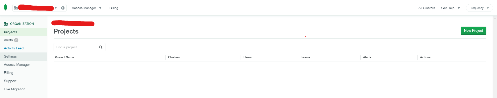
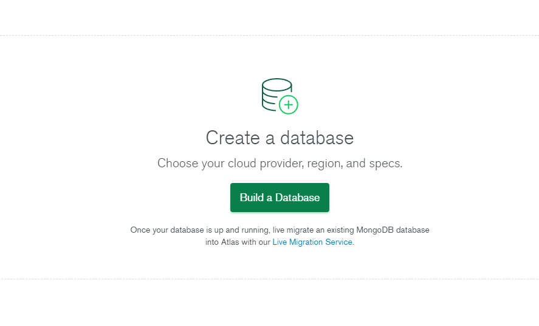
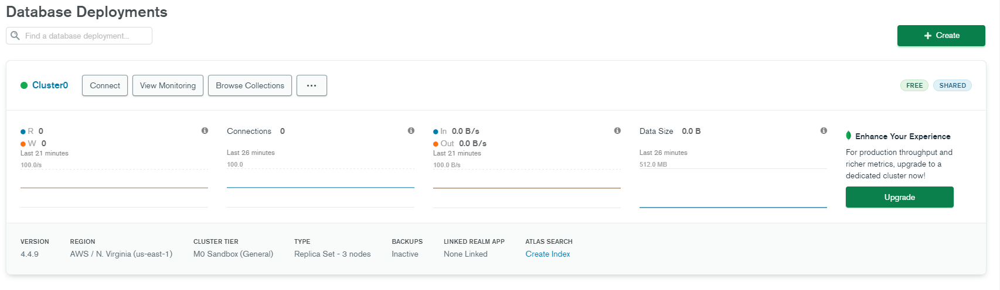
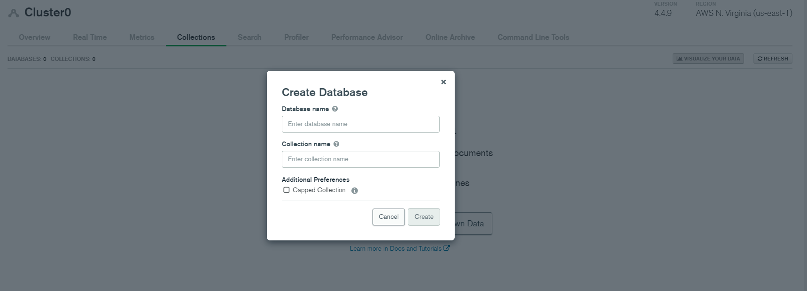
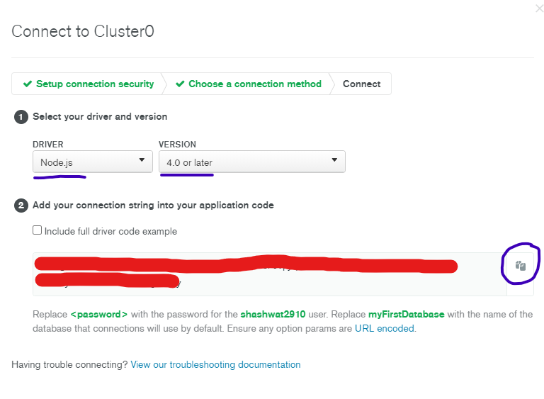

# How to Connect MongoDB Atlas with Spring-boot Framework

Heyy Coders!!! My name is Shashwat Sharma and in this repository we will learn how to connect your data base which is in MongoDB Atlas to Spring-boot which is a framework in JAVA.

## Follow these Steps

## Spring initializer

- The link to start Spring-Boot use this link :- https://start.spring.io/
- It is Maven Project, Packaging is JAR and java version is 11
- Dependencies used are Spring Web, Spring Data MongoDB and Spring Boot Dev Tools.
- name and artifact depends on you
- Open pom.xml file using IntelliJ IDE

## Cloud MongoDB Atlas

- Go on https://www.mongodb.com/cloud ; Sign Up or Login if you have 

- Click on new project
- Follow the steps
- Clusters usually take 2-5 mins to get build
- Something will show up
 
- Click on Build a Database
- You will see a dashboard like this

- If you see this click on Browse Collections
- Click add my own data

- Name the database and collection name according to your choice
- You will see dashboard again
- Click on Connect

- For add a connection ip address click on allow access from anywhere
- create a database user and *remeber the username and password will be needed afterwards*
- now click choose connection method
- click connect your application

- copy the code 
